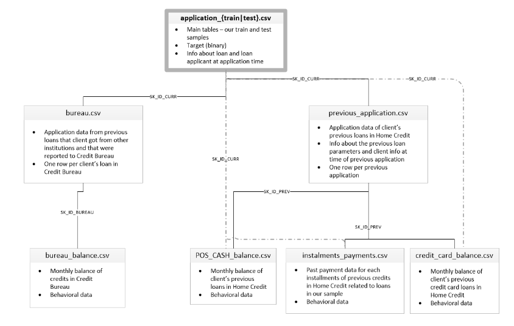

# IMPLEMENTEZ UN MODELE DE SCORING

## Sixième projet de ma formation de Data Scientist

## Contexte

  

Vous êtes Data Scientist au sein d'une société financière, nommée "Prêt à dépenser", qui propose des crédits à la consommation pour des personnes ayant peu ou pas du tout d'historique de prêt. L’entreprise souhaite mettre en œuvre un outil de “scoring crédit” pour calculer la probabilité qu’un client rembourse son crédit, puis classifie la demande en crédit accordé ou refusé. Elle souhaite donc développer un algorithme de classification en s’appuyant sur des sources de données variées (données comportementales, données provenant d'autres institutions financières, etc.). De plus, les chargés de relation client ont fait remonter le fait que les clients sont de plus en plus demandeurs de transparence vis-à-vis des décisions d’octroi de crédit. Cette demande de transparence des clients va tout à fait dans le sens des valeurs que l’entreprise veut incarner. Prêt à dépenser décide donc de développer un dashboard interactif pour que les chargés de relation client puissent à la fois expliquer de façon la plus transparente possible les décisions d’octroi de crédit, mais également permettre à leurs clients de disposer de leurs informations personnelles et de les explorer facilement.

## Préambule
Ce projet a été réalisé en langage Python dans des Jupyter Notebooks et Streamlit a été utilisé pour la création du Dashboard interactif. Le déploiement du dashboard interactif et de l’API ont été réalisés respectivement sur les plateformes Cloud Streamlit et Heroku.

## Les données
Les données sont issues de Kaggle et sont disponibles à l'adresse suivante : https://www.kaggle.com/c/home-credit-default-risk/data

Les données sont réparties dans différentes tables, nécessitant ainsi des jointures ultérieures.

  

Un kernel Kaggle a également été mis à disposition afin de faciliter l’analyse exploratoire, la préparation des données et le feature engineering nécessaires à l’élaboration du modèle de scoring (https://www.kaggle.com/code/jsaguiar/lightgbm-with-simple-features/script). **Etant optionnel, ce dernier n'a pas été utilisé**.

## Missions
1. Construction d'un modèle de scoring prédisant la probabilité de faillite d'un client de façon automatique.
2. Construction d'un dashboard interactif destiné aux gestionnaires de la relation client permettant l'interprétations des prédictions faites par le modèle et l’amélioration de la connaissance client des chargés de relation client.
3. Mise en production du modèle de scoring de prédiction à l’aide d’une API, ainsi que du dashboard interactif appelant l’API pour les prédictions.

## Contenu de ce dépôt
1. Un dossier Applications contenant l’API réalisée avec Flask ainsi que deux scripts pour le dashboard interactif réalisé avec streamlit (un contenant l'ensemble des clients du jeu de test, un ne contenant que les 1000 premiers clients).
2. Un dossier DataDrift contenant les rapports "data_drift_report.html" et "data_stability.html". 
3. Un dossier Datas contenant: (i) le graphe de la RFE-CV obtenu à partir d'un Random Forest Classifier sur 75000 clients mais aussi le "ranking" issu de la RFE, (ii) la description des 30 variables utilisées pour l’élaboration de modèle, (iii) les rapports de classification, matrice de confusion et courbe ROC obtenus lors de la réalisation de SMOTE et (iv) les dataframes d'entraînement et de test utilisés pour l'élaboration du modèle, respectivement "trainset_rfe_30f.csv" et "testset_rfe_30f.csv".
4. Un dossier Notebooks contenant les 8 notebooks permettant l'élaboration du modèle final de scoring, l’analyse de la dérive des données (DataDrift) ainsi que les prédictions sur les nouveaux clients *via* l’API ou non.
5. Les fichiers suivants : (i) la sauvegarde sous format pickle du modèle retenu ("basic_lgbmc.pkl") et des données scalées *via* avec le MinMaxScaler lors de l’entraînement du modèle ("minmax_scaler.pkl"), (ii) les fonctions utilisées lors de la mise en place du modèle "fonctions_p7.py", (iii) deux scripts pour les tests unitaires: l'un pour leurs réalisations en local ("pytest_tests.py") et l'autre pour leurs réalisations lors du déploiement continu ("test_pytest_tests.py"), (iv) la note méthodologique, (v) le logo de la société et le schéma du jeu de données sous format png et (vi) les fichiers générés pour les déploiements de l'API (Procfile, runtime.txt, .slugignore) et du dashboard interactif (requirements.txt également nécessaire pur l'API).
6. Un dossier .github/workflows contenant des fichiers YAML (extension .yml) décrivant les workflows d'intégration continue/déploiement continu (CI/CD): le déploiement sur Heroku "api_heroku.yml" et les tests unitaires "pytests_tests.yml".
7. Le support de présentation pour la soutenance sous format pdf: presentation_13.pdf.

## Compétences acquises
1. Nettoyage des données, feature engineering et gestion des valeurs manquantes spécifiques à la problématique métier.
2. Mise en place d'un score métier et d'un seuil métier.
3. Sélection des variables les plus pertinentes *via* une RFE-CV.
4. Gestion du déséquilibre des classes.
5. Elaboration d’un modèle d’apprentissage supervisé avec recherche d'optimisation des hyperparamètres.
6. Mise en oeuvre d'un "tracking" des différents modèles testés par une démarche de type MLOps *via* MLFLow.
7. Analyse de la dérive des données (Data Drift) à l'aide d'evidently.
8. Rédaction d'une note méthodologique.
9. Notion de déploiement d'une API de prédiction simple réalisée avec Flask sur Heroku.
10. Réalisation d'un tableau de bord interactif avec Streamlit appelant l'API pour effectuer les prédictions et déploiement de ce dernier sur Streamlit.
11. Réalisation de tests unitaires avec Pytest de manière automatisée ou non.
12. Notion de déploiement continu et automatisé du code de l'API sur le cloud *via* GitHub Actions.

## Liens pour les dashboards interactifs
1. Version contenant les 48744 clients: https://colple-implementez-un-m-applicationsstreamlit-interactif-e6beqf.streamlit.app/
2. Version ne comprenant que les 1000 premiers clients: https://implementezunmodeledescoring-vuwuspwad8k6jktck7tawc.streamlit.app/

## Auteur
**Coline Plé**

